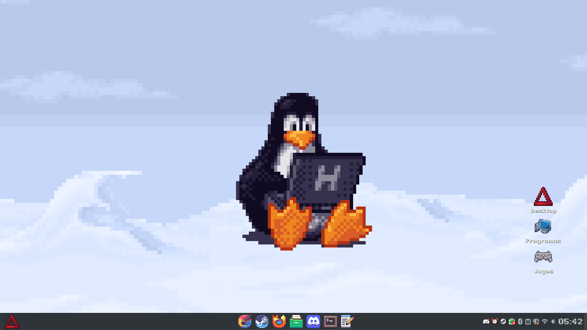

```markdown
# 🟫 DeltaPixel Theme
```


Uma "rice" completa para Linux (focada no Cinnamon) com estética pixel art, inspirada em interfaces retrô e sistemas de 8/16 bits.


## 📸 Screenshot


*Exemplo do sistema aplicado com o tema DeltaPixel.*

---

## 🛠️ O que está incluso?

* **Assets:** Ícone Delta customizado para o Menu iniciar.
* **Dotfiles:** Configurações de painel, applets e atalhos de menu.
* **Game Icons:** Pack de ícones de jogos para aplicação manual.
* **Wallpapers:** Uma coleção curada de fundos pixelados.
* **Fonts:** Família de fontes `Pixeloid` (Mono, Sans e Bold).
* **Themes & Icons:** Pastas `.themes` e `.icons` prontas para uso.


## 🚀 Como Instalar

### 1. Clonar o repositório
```bash
git clone [https://github.com/MrDeltaMan/deltapixel-theme.git](https://github.com/MrDeltaMan/deltapixel-theme.git)
cd deltapixel-theme

```


### 2. Rodar o Script de Instalação

O script irá mover as fontes, ícones e temas para as pastas corretas automaticamente.

```bash
chmod +x install.sh
./install.sh

```

### 3. Aplicar as configurações do Cinnamon (Opcional)

Para deixar o painel e os applets iguais aos da screenshot, importe o arquivo dconf:

```bash
dconf load /org/cinnamon/ < dotfiles/cinnamon/cinnamon.dconf

```

*⚠️ Aviso: Isso irá sobrescrever suas configurações atuais do painel Cinnamon.*

---

## 🎨 Ajustes Manuais Recomendados

* **Menu Iniciar:** Clique com o botão direito no menu > Configurar > Use o ícone customizado localizado em `assets/DELTA.png`.
* **Fontes:** Nas configurações de sistema, altere as fontes da interface para `Pixeloid Sans`.
* **Ícones de Jogos:** Para os ícones da pasta `game icons`, você deve alterar manualmente as propriedades do atalho (.desktop) do seu jogo.

## 🤝 Créditos

Este projeto não seria possível sem o trabalho incrível de outros artistas. Confira os detalhes completos no arquivo [CREDITS.txt](https://www.google.com/search?q=CREDITS.txt).

---

Criado com ☕ e muito pixel por [Mr.Delta-Man]

```


